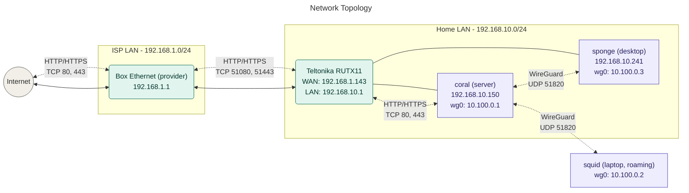
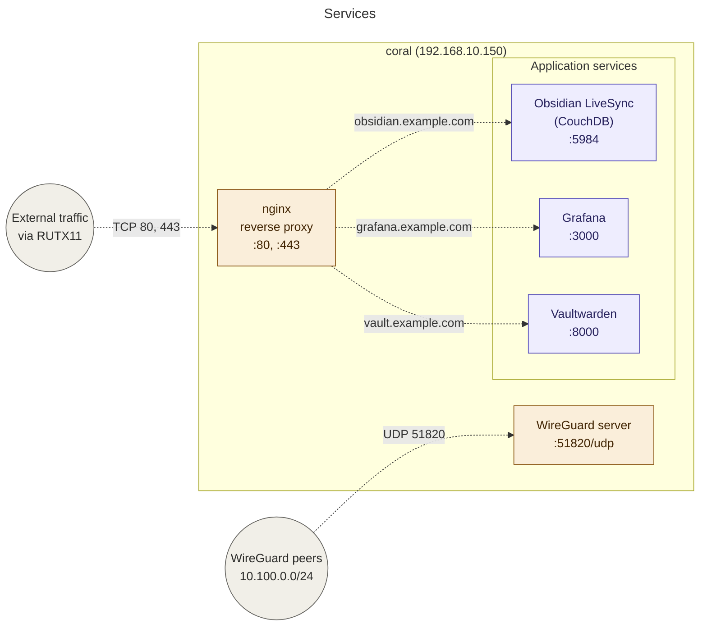

# nix-config

Personal NixOS / home-manager configuration, structured as a [`flake-parts`](https://flake.parts) flake using the [dendritic pattern](https://github.com/mirkolenz/flocken) — every concern lives in its own module file, auto-imported via [`import-tree`](https://github.com/vic/import-tree).

This repo defines:

- The full configuration of every machine I run
- A WireGuard mesh that lets them talk to each other regardless of where I am
- Reverse-proxied services exposed publicly through my ISP router
- Reusable home-manager modules and packaging wrappers
- Secrets management via [sops-nix](https://github.com/Mic92/sops-nix)
- Disk layout via [disko](https://github.com/nix-community/disko) and Secure Boot via [lanzaboote](https://github.com/nix-community/lanzaboote)

## Network topology



The setup is double-NATed behind the ISP-provided Box (`192.168.1.0/24`).\
The Teltonika RUTX11 acts as the actual home router, carving out `192.168.10.0/24` for my own gear.

Public HTTP/HTTPS reaches the home LAN through a port-forward chain: the Box accepts `:80`/`:443`, forwards to the RUTX11 on non-standard ports `:51080`/`:51443` (because the Box reserves the standard ports for itself), which the RUTX11 then forwards to coral on standard `:80`/`:443`.

WireGuard terminates on **coral**, not on the router. UDP `51820` is forwarded down the same chain.

## Services



## Hosts

| Host       | Role                          | Address (LAN)    | WireGuard    |
| ---------- | ----------------------------- | ---------------- | ------------ |
| **coral**  | Server, reverse proxy, WG hub | `192.168.10.150` | `10.100.0.1` |
| **sponge** | Desktop (niri, daily driver)  | `192.168.10.241` | `10.100.0.3` |
| **squid**  | Laptop (roaming)              | —                | `10.100.0.2` |

Each host has a corresponding `nixosConfigurations.<name>` exposed by the flake, built from a host-specific module plus shared modules.

## Repository layout

The flake is dendritic — `flake.nix` does almost nothing, and every output is defined inside `modules/` as a small flake-parts module.\
`import-tree` walks the directory and feeds every `.nix` file into `mkFlake`.

```
.
├── flake.nix              # mkFlake + import-tree, nothing else
├── flake.lock
├── modules/
│   ├── core/              # systems list, flake-parts imports (home-manager, etc.)
│   ├── hosts/             # one file per host: coral.nix, sponge.nix, squid.nix
│   ├── hardware/          # disko + hardware-configuration per host
│   ├── nixos/             # reusable NixOS modules (users, locale, ssh, ...)
│   ├── home/              # reusable home-manager modules
│   ├── services/          # service modules (nginx, wireguard, vaultwarden, ...)
│   ├── features/          # opt-in feature bundles (desktop, dev, gaming, ...)
│   ├── packages/          # custom packages and wrappers (e.g. niri)
│   └── secrets/           # sops-nix wiring (encrypted blobs live in secrets/)
└── README.md
```

## Common tasks

### Build and switch a machine

On the target host:

```bash
sudo nixos-rebuild switch --flake .#<hostname>
```

### Test a host config in a VM (no risk to the real machine)

```bash
nixos-rebuild build-vm --flake .#<hostname>
./result/bin/run-<hostname>-vm
```

### Update inputs

```bash
nix flake update
```

Or update a single input:

```bash
nix flake lock --update-input nixpkgs
```

### Edit a secret

```bash
sops modules/secrets/<file>.yaml
```

### Add a new host

1. Create `modules/hosts/<name>.nix` with `flake.nixosConfigurations.<name>`.
2. Create `modules/hardware/<name>.nix` with the hardware module.
3. If it joins the WireGuard mesh, add a peer entry under `modules/services/wireguard/`.
4. `nix flake check` to validate.

## Conventions

- **One concern per file.** A file should answer "if I want to change X, do I open this file?" with a clear yes or no.
- **Reusable modules go under `flake.nixosModules` / `flake.homeModules`**, not directly into a host. Hosts compose modules; they don't define logic.
- **Hardware lives in its own module** so VMs and test rigs can `disabledModules = [ self.nixosModules.<host>Hardware ]` to drop it.
- **No secrets in plaintext, ever.** sops-nix is the only path. The repo is public-safe.

## License

Personal config — feel free to copy patterns; no warranty implied.
