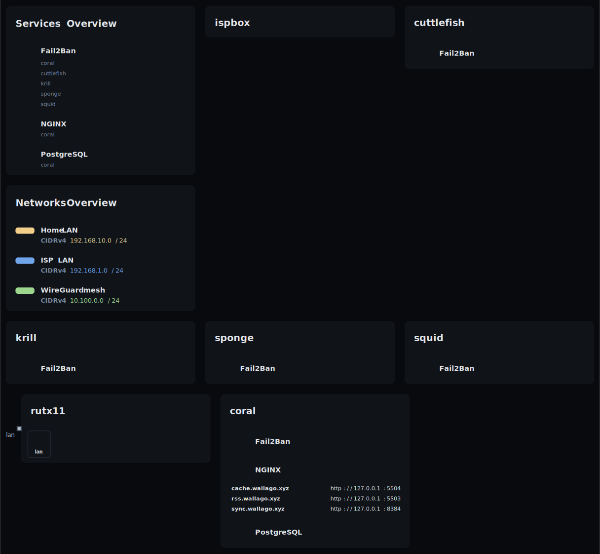

# nix-config



Personal NixOS / home-manager configuration, structured as a [`flake-parts`](https://flake.parts) flake using the [dendritic pattern](https://github.com/mirkolenz/flocken): every concern is its own module file under `modules/`, auto-imported via [`import-tree`](https://github.com/vic/import-tree).

What's in here:

- Full configuration for every machine I run (see [Hosts](#hosts))
- A WireGuard mesh (hub-and-spoke, terminated on **coral**) linking them wherever they are
- Web services reverse-proxied through nginx on coral (miniflux, an [attic](https://github.com/zhaofengli/attic) Nix cache, …)
- Secrets via [sops-nix](https://github.com/Mic92/sops-nix), disk layout via [disko](https://github.com/nix-community/disko)

The diagram above is generated from the config by [`nix-topology`](https://github.com/oddlama/nix-topology), so it stays in sync with reality.

## Network

The home network is double-NATed behind the ISP box (`192.168.1.0/24`). A Teltonika RUTX11 is the real router, carving out `192.168.10.0/24` for my gear.

Public HTTP/HTTPS reaches coral through a port-forward chain: the Box accepts `:80`/`:443` and forwards to the RUTX11 on `:51080`/`:51443` (the Box reserves the standard ports), which forwards on to coral on `:80`/`:443`. WireGuard (`51820/udp`) follows the same chain and terminates on **coral**, not the router.

## Hosts

| Host           | Role                                 | WireGuard    |
| -------------- | ------------------------------------ | ------------ |
| **coral**      | Server — nginx reverse proxy, WG hub | `10.100.0.1` |
| **squid**      | Laptop (roaming)                     | `10.100.0.2` |
| **sponge**     | Desktop (niri, daily driver)         | `10.100.0.3` |
| **cuttlefish** | Server (remote, WG client)           | `10.100.0.4` |
| **krill**      | Server — GitHub Actions runners      | `10.100.0.5` |

Each host is a `nixosConfigurations.<name>` built from its own module under `modules/hosts/<name>/` plus shared modules. LAN addresses live in the config and in the topology diagram.

## Repository layout

`flake.nix` does almost nothing: it calls `mkFlake` with `import-tree ./modules`, which feeds every `.nix` file under `modules/` into flake-parts. There are no manual `imports` lists — to add a module, drop a file in the tree.

```
.
├── flake.nix          # mkFlake + import-tree
├── justfile           # workflow entry point (run `just` to list)
└── modules/
    ├── base/          # core defaults + the `preferences.*` option set
    ├── features/      # opt-in features (desktop, developer, gaming, gpu, …)
    ├── hosts/<name>/  # per-host configuration.nix, hardware.nix, disko.nix, secrets.nix
    ├── users/         # user definitions
    ├── secrets/       # sops-nix wiring (encrypted blobs)
    └── parts.nix      # systems list + formatter
```

## Common tasks

The `justfile` is the entry point — run `just` to list recipes.

```bash
just                  # list recipes
just hosts            # list configured hosts
just diff <host>      # preview changes (dry-activate)
just switch <host>    # build + activate on <host>
just test <host>      # activate without making it the boot default
just check            # nix flake check + format
just update           # update flake inputs
just secret <file>    # edit a sops-encrypted secret
```

## License

Personal config — feel free to copy patterns; no warranty implied. See [LICENSE](LICENSE).
